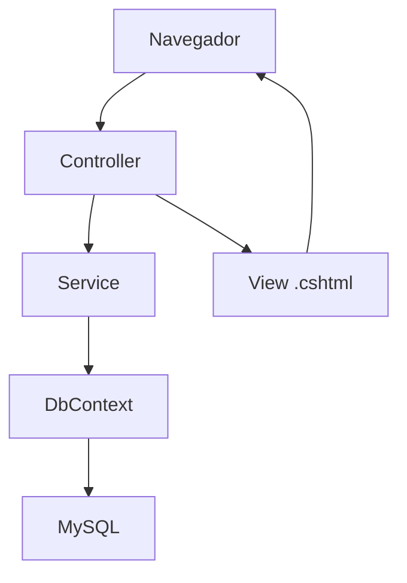
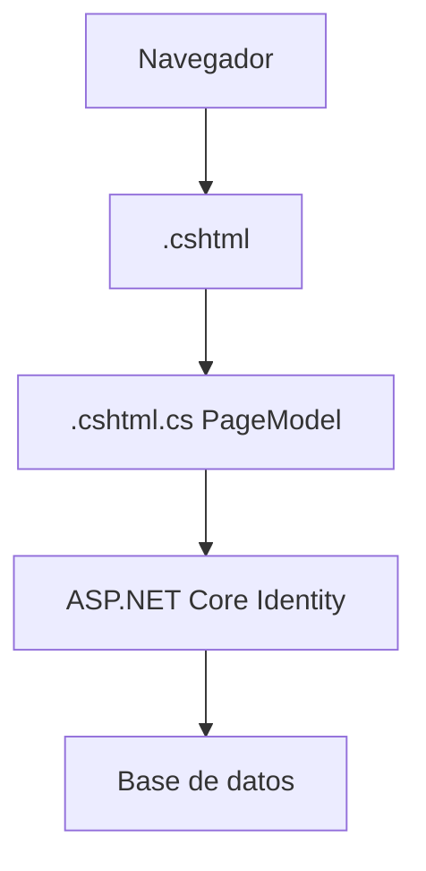

# Arquitectura de Softball-Scorer

Softball-Scorer es una aplicacion ASP.NET Core MVC para administrar equipos, jugadores, partidos, alineaciones, marcador, jugadas y estadisticas de softbol.

## Regla importante de nombres

Hay carpetas y nombres que NO conviene traducir ni mover porque ASP.NET Core los reconoce por convencion:

- `Controllers`
- `Views`
- `Areas`
- `Identity`
- `Pages`
- `Account`
- `wwwroot`
- `Program.cs`

Si se renombran sin actualizar referencias, rutas y namespaces, la aplicacion puede dejar de encontrar vistas, controladores, archivos estaticos o pantallas de login.

## Lenguajes usados

| Lenguaje / formato | Donde vive | Funcion |
| --- | --- | --- |
| C# | `Controllers`, `Modelos`, `Servicios`, `Datos`, `Hubs`, `Infra`, `ViewModels` | Logica del sistema, reglas de negocio, entidades y acceso a datos. |
| Razor / CSHTML | `Views` y `Areas/Identity/Pages` | Pantallas que mezclan HTML con C#. |
| HTML | Dentro de `.cshtml` | Estructura visual de las pantallas. |
| CSS | `wwwroot/css` | Diseno, colores, tarjetas, tablas y responsive. |
| JavaScript | `wwwroot/js` | Comportamiento en el navegador y actualizacion del marcador sin recargar. |
| SQL / MySQL | Base de datos `softball` | Datos persistentes. |
| JSON | `appsettings*.json` y snapshots de jugadas | Configuracion y datos historicos guardados como texto estructurado. |

No hay Java en este proyecto. Hay JavaScript, que es otro lenguaje.

## Mapa de carpetas

| Carpeta | Que hace | Se conecta con | No tocar sin cuidado |
| --- | --- | --- | --- |
| `Controllers` | Recibe acciones del usuario y decide que devolver. | `Views`, `Servicios`, `ContextoMarcador`. | Rutas, nombres de acciones y nombres de controladores. |
| `Views` | Pantallas MVC normales. | `Controllers`, `ViewModels`, CSS/JS. | Nombres de carpetas que coinciden con controladores. |
| `Modelos` | Entidades de dominio y tablas. | `ContextoMarcador`, migraciones, servicios. | Propiedades usadas por EF Core o migraciones. |
| `Modelos/ViewModels` | Datos preparados para vistas del dominio. | `Controllers`, `Views`, servicios. | Propiedades usadas por vistas. |
| `ViewModels` | Datos de login/registro del `AccountController`. | `Views/Account`, `AccountController`. | Nombres de propiedades validadas en formularios. |
| `Servicios` | Logica de negocio reusable. | Controladores, DB, modelos. | Reglas de marcador y calculos de estadisticas. |
| `Servicios/Marcador` | Nucleo del anotador. | `PartidosController`, `PlayLog`, `PlayerBattingStat`, SignalR. | Calculo de outs, bases, carreras y turno. |
| `Datos` | Acceso a base de datos y seeds. | EF Core, MySQL, modelos. | `ContextoMarcador` y configuracion de relaciones. |
| `Dtos` | Datos livianos que viajan al frontend. | Servicios, controladores, JavaScript. | Contratos usados por `marcador.js`. |
| `Helpers` | Funciones de apoyo. | Servicios/controladores. | Formato de snapshots e innings. |
| `Hubs` | SignalR para tiempo real. | `marcador.js`, `MarcadorService`. | Nombre del hub y metodos que llama JS. |
| `Infra` | Codigo tecnico de soporte. | Program.cs, Identity, email. | Seed inicial de usuario admin. |
| `Areas/Identity` | Razor Pages de login/recuperacion de contrasena de Identity. | ASP.NET Core Identity. | No mover si no se conoce Razor Pages. |
| `Migrations` | Historial de estructura de base de datos. | EF Core/MySQL. | No editar a mano salvo necesidad clara. |
| `wwwroot` | Archivos publicos del navegador. | Layout, vistas, navegador. | Rutas de CSS/JS ya referenciadas. |
| `docs` | Documentacion del proyecto. | Equipo de desarrollo. | Mantener actualizada cuando cambie arquitectura. |

## Flujo MVC normal

Ejemplo:

1. El usuario entra a `/Partidos/VerPartido/1`.
2. `PartidosController` carga el partido.
3. Usa `ContextoMarcador` y `MarcadorService`.
4. Devuelve `Views/Partidos/VerPartido.cshtml`.

## Flujo Razor Pages de Identity

Razor Pages no usa un Controller visible para cada pantalla. Cada pantalla tiene:

- `.cshtml`: HTML/Razor que se ve.
- `.cshtml.cs`: clase `PageModel` con la logica.

## Componentes principales

| Componente | Funcion |
| --- | --- |
| `Program.cs` | Configura servicios, base de datos, Identity, rutas, SignalR y arranque. |
| `ContextoMarcador` | Puente entre C# y MySQL. Define tablas y relaciones. |
| `PartidosController` | Controla crear/ver partidos, registrar turnos, eventos y reportes. |
| `MarcadorService` | Aplica jugadas reales: outs, bases, carreras, historial, estadisticas y cambios de entrada. |
| `marcador.js` | Actualiza marcador, outs, bases y bateador actual en el navegador. |
| `MarcadorHub` | Canal de SignalR para avisar cambios en tiempo real. |
| `ReportesService` | Genera CSV de box score y jugada por jugada. |
| `EstadisticasService` | Calcula estadisticas por jugador/equipo. |
| `IdentitySeeder` | Crea usuario/roles iniciales. |

## Puntos delicados

- `MarcadorService` es la pieza mas delicada del anotador.
- `ContextoMarcador` afecta la base de datos y migraciones.
- `marcador.js` depende de nombres de ids HTML en las vistas.
- `PartidosController` conecta formularios con servicios.
- `Areas/Identity` depende de convenciones de Razor Pages.
- `appsettings*.json` contiene la cadena de conexion a MySQL.

