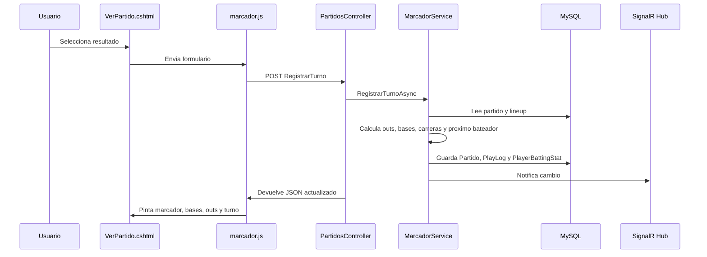
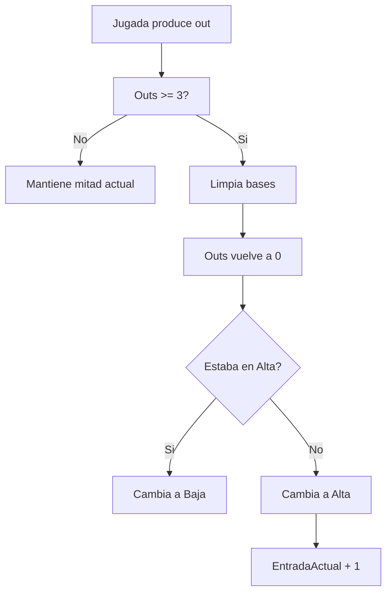

# Flujo del marcador/anotador

Este documento explica como se registra una jugada en el sistema y que archivos participan.

## Archivos principales

| Archivo | Funcion |
| --- | --- |
| `Views/Partidos/VerPartido.cshtml` | Pantalla donde el anotador registra jugadas. |
| `wwwroot/js/marcador.js` | Envia formularios, refresca marcador y actualiza la pantalla. |
| `Controllers/PartidosController.cs` | Recibe las acciones del anotador. |
| `Servicios/Marcador/MarcadorService.cs` | Calcula la jugada y guarda el nuevo estado. |
| `Datos/ContextoMarcador.cs` | Guarda/carga datos en MySQL. |
| `Hubs/MarcadorHub.cs` | Avisa a otros clientes que el marcador cambio. |
| `Modelos/PlayLog.cs` | Historial de jugadas. |
| `Modelos/PlayerBattingStat.cs` | Estadisticas acumuladas por turno. |

## Diagrama general

## Paso a paso de una jugada

1. El anotador elige un resultado: Hit, Doble, Triple, Jonron, Ponche, Out, etc.
2. `marcador.js` intercepta el formulario para no recargar toda la pagina.
3. `PartidosController.RegistrarTurno` valida:
   - partido existe
   - partido esta en curso
   - hay lineup definido
   - hay bateador esperado
   - si el bateador no toca, pide confirmacion
4. `MarcadorService.RegistrarTurnoAsync` inicia una transaccion.
5. Carga el partido, entrada y lineup del equipo que batea.
6. Toma snapshot antes de la jugada.
7. Aplica resultado:
   - suma outs
   - mueve bases
   - suma carreras
   - suma hits/errores
   - actualiza estadisticas
8. Si llega a 3 outs, cambia Alta/Baja o avanza el inning.
9. Avanza el indice del proximo bateador del equipo correcto.
10. Guarda `PlayLog` y `PlayerBattingStat`.
11. Notifica por SignalR.
12. Devuelve JSON al navegador.

## Cambio de entrada

## Turno al bate

Cada equipo tiene su propio indice:

- `IndexBateadorVisita`
- `IndexBateadorCasa`

Cuando el visitante batea en Alta, avanza `IndexBateadorVisita`.

Cuando la casa batea en Baja, avanza `IndexBateadorCasa`.

Si llega al ultimo jugador, vuelve al primero.

## Bateador fuera de turno

Si el usuario selecciona otro bateador:

1. `marcador.js` muestra una confirmacion.
2. Si cancela, vuelve al bateador correcto.
3. Si confirma, se guarda como correccion manual.
4. `PlayLog.EsCorreccionManual` queda en `true`.

## Historial

El historial usa `PlayLog`.

Guarda:

- partido
- jugador registrado
- jugador esperado
- equipo que bateaba
- resultado
- carreras de la jugada
- snapshot antes/despues
- si fue correccion manual

## Estadisticas

Cada turno genera una fila en `PlayerBattingStat`.

Luego `EstadisticasService` suma esas filas para mostrar lideres, promedios y totales.

## Cuidado al modificar

- No dupliques reglas de jugadas en JavaScript.
- JavaScript debe mostrar lo que el backend ya calculo.
- Si cambias nombres de campos en `MarcadorDto`, actualiza `marcador.js`.
- Si cambias una entidad, revisa migraciones y tests.
- Si cambias outs/bases/carreras, corre pruebas de `MarcadorServiceTests`.

