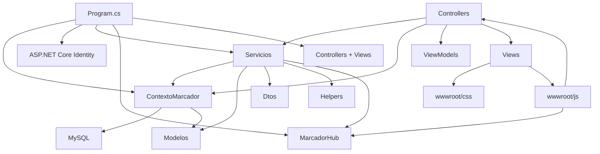
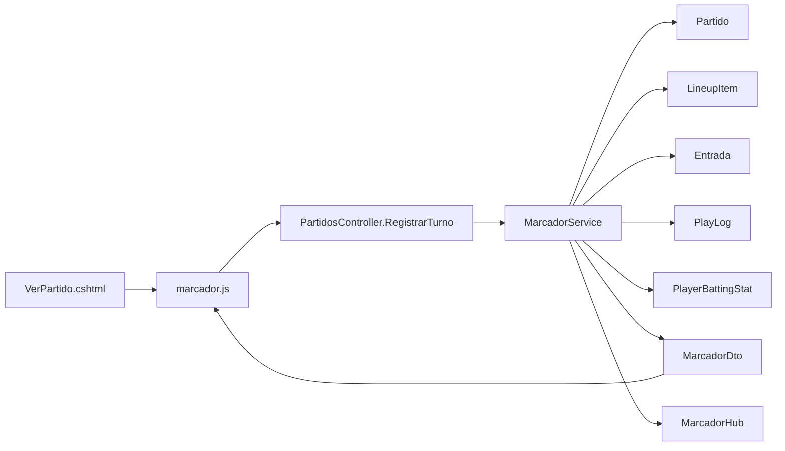

# Mapa de dependencias

Este mapa muestra que pieza depende de cual.

## Dependencias principales

## Tabla de conexion por carpeta

| Carpeta | Depende de | La usan |
| --- | --- | --- |
| `Controllers` | Servicios, Datos, Modelos, ViewModels | Rutas del navegador. |
| `Servicios` | Datos, Modelos, Dtos, Helpers | Controladores y tests. |
| `Datos` | EF Core, Modelos, MySQL | Servicios, controladores, seeds. |
| `Modelos` | DataAnnotations/EF Core | Datos, servicios, vistas. |
| `Dtos` | Modelos simples | Servicios, controladores, JavaScript. |
| `Views` | ViewModels, Bootstrap, CSS, JS | Navegador. |
| `wwwroot/js` | IDs HTML, endpoints MVC, SignalR | Vistas. |
| `wwwroot/css` | Clases HTML de vistas/layout | Vistas. |
| `Areas/Identity` | Identity, Razor Pages | Login/recuperacion de contrasena. |
| `tests` | Proyecto web | Validar reglas. |

## Dependencias del marcador

## Archivos que no conviene tocar rapido

| Archivo | Por que |
| --- | --- |
| `Program.cs` | Configura toda la app. Un cambio aqui puede impedir que arranque. |
| `Datos/ContextoMarcador.cs` | Cambios afectan la base de datos y migraciones. |
| `Servicios/Marcador/MarcadorService.cs` | Es el corazon de jugadas, outs, bases, carreras y turnos. |
| `Dtos/MarcadorDto.cs` | JavaScript espera esos campos. |
| `wwwroot/js/marcador.js` | Depende de ids HTML y endpoints. |
| `Views/Shared/_Layout.cshtml` | Afecta todas las pantallas. |
| `Areas/Identity` | Usa convenciones de Razor Pages. |

## Partes secundarias

| Parte | Estado |
| --- | --- |
| `Areas/Identity/Pages/Account/ForgotPassword*` | Secundario. Sirve para recuperar contrasena. |
| `Areas/Identity/Pages/Account/ResetPassword*` | Secundario. Sirve para restablecer contrasena con token. |
| `Views/Home/Privacy.cshtml` | Plantilla generica. Si no hay link activo, puede eliminarse en una limpieza futura. |
| `wwwroot/css/marcador.css` | Revisar si todavia aporta estilos. Puede consolidarse en `site.css` si no se usa. |

