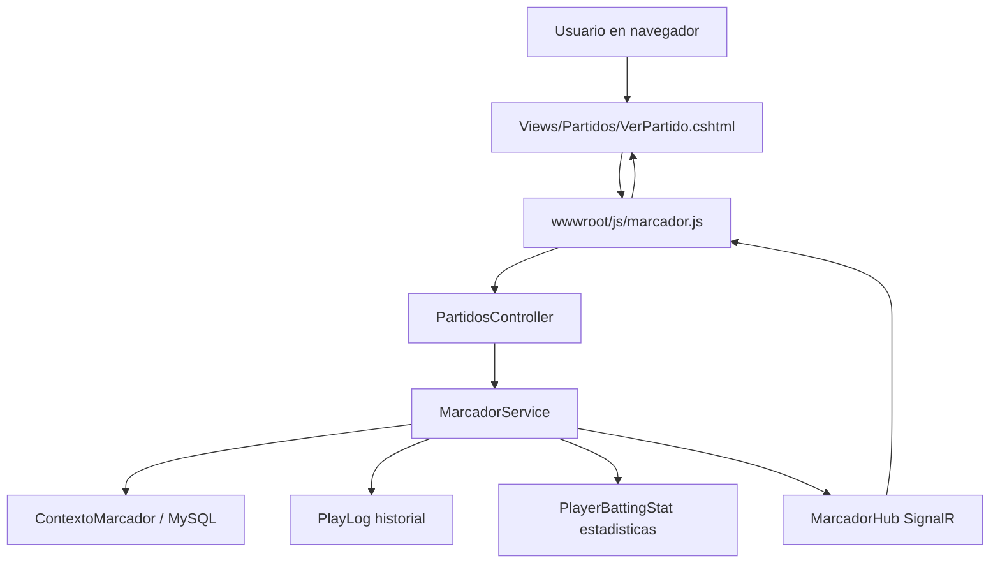
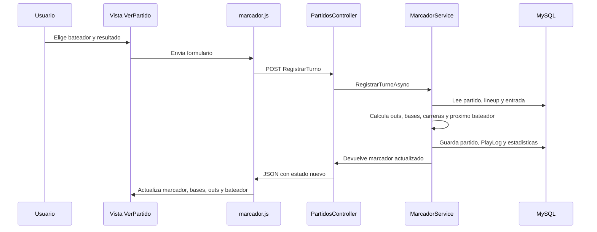
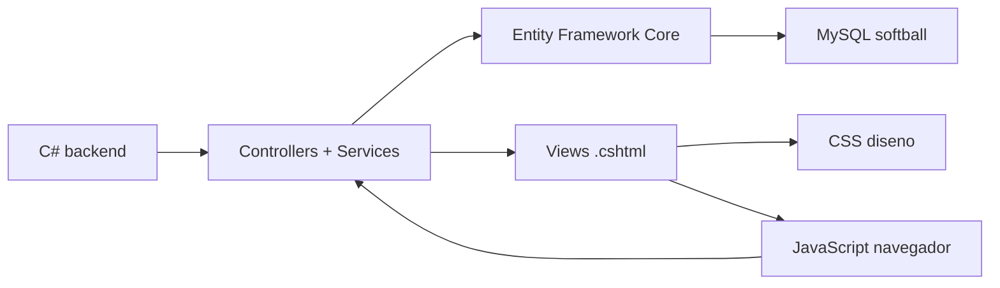

# Mapa tecnico del proyecto Softball Scorer

Este documento explica, en palabras simples, que usa el proyecto, que carpeta hace cada cosa y como se conectan las piezas principales.

## Lenguajes y tecnologias usadas

| Tipo | Donde aparece | Para que sirve |
| --- | --- | --- |
| C# | `Controllers`, `Modelos`, `Servicios`, `Datos`, `Hubs`, `Program.cs` | Logica del sistema, reglas del partido, acceso a base de datos, login y rutas. |
| Razor / CSHTML | `Views`, `Areas/Identity/Pages` | Pantallas HTML con C# mezclado. Ejemplo: login, partidos, jugadores, marcador. |
| HTML | Dentro de los `.cshtml` | Estructura visual de las paginas. |
| CSS | `wwwroot/css/site.css`, `wwwroot/css/marcador.css`, estilos internos de algunas vistas | Diseno visual, responsive, colores, tarjetas, tablas y marcador. |
| JavaScript | `wwwroot/js/marcador.js`, `wwwroot/js/site.js` | Actualizacion en vivo del marcador, botones rapidos, formularios sin recargar toda la pagina. |
| SQL / MySQL | Base `softball`, migraciones EF Core | Guarda equipos, jugadores, partidos, jugadas, estadisticas y usuarios. |
| JSON | `appsettings*.json`, snapshots de jugadas | Configuracion y datos historicos de antes/despues de cada jugada. |

No hay Java. Lo que hay es JavaScript, que es otro lenguaje distinto y se usa en el navegador.

## Carpetas principales

| Carpeta | Funcion |
| --- | --- |
| `Controllers` | Reciben solicitudes del navegador y deciden que vista o accion ejecutar. |
| `Modelos` | Clases que representan tablas y conceptos del sistema: jugador, equipo, partido, entrada, jugada. |
| `Modelos/ViewModels` | Clases para llevar datos preparados hacia las vistas. |
| `ViewModels` | ViewModels del login y registro actual. |
| `Views` | Pantallas MVC del sistema. |
| `Servicios` | Logica de negocio. Aqui vive lo mas importante del marcador. |
| `Servicios/Marcador` | Servicio que registra jugadas, outs, bases, carreras, historial y estadisticas. |
| `Datos` | DbContext y seed de datos. Es la puerta hacia MySQL. |
| `Dtos` | Objetos pequenos que se mandan al frontend, por ejemplo el estado actual del marcador. |
| `Helpers` | Funciones de apoyo para normalizar entradas y leer snapshots. |
| `Hubs` | SignalR para actualizacion en tiempo real. |
| `Infra` | Cosas tecnicas de infraestructura: seed de usuario admin y email dummy. |
| `Migrations` | Historial de cambios de la base de datos generados por EF Core. |
| `wwwroot` | Archivos publicos: CSS, JavaScript, librerias, favicon. |
| `Areas/Identity` | Paginas Razor de Identity para recuperar/restablecer contrasena. |
| `docs` | Documentacion del proyecto. |
| `tests` | Pruebas automaticas. |

## Flujo principal del marcador

## Flujo cuando se registra una jugada

## Que conecta con que

| Pieza | Conecta con | Comentario |
| --- | --- | --- |
| `_Layout.cshtml` | `site.css`, `marcador.js`, SignalR, menu lateral | Es la plantilla general de casi todas las pantallas. |
| `PartidosController` | `MarcadorService`, `ReportesService`, `ContextoMarcador` | Controla partidos, marcador, CSV y acciones. |
| `MarcadorService` | `ContextoMarcador`, `MarcadorHub`, modelos `Partido`, `PlayLog`, `PlayerBattingStat` | Corazon del anotador. |
| `ContextoMarcador` | MySQL y modelos | Define tablas y relaciones. |
| `marcador.js` | `MarcadorJson`, `RegistrarTurno`, SignalR | Actualiza la pantalla sin recargar. |
| `EstadisticasService` | `PlayerBattingStats`, `Jugadores`, `Equipos` | Calcula estadisticas por jugador/equipo. |
| `ReportesService` | datos de partido | Genera descargas CSV. |

## Partes secundarias o que pueden confundirte

| Parte | Estado | Recomendacion |
| --- | --- | --- |
| `Areas/Identity/Pages/Account/ForgotPassword*` | Conectado a Razor Pages, pero no es parte del flujo normal del anotador. | Mantener solo si quieres recuperar contrasena por correo. Si no, se puede quitar o esconder. |
| `Areas/Identity/Pages/Account/ResetPassword*` | Igual que arriba. | Secundario. |
| `Views/Home/Privacy.cshtml` | Pagina de plantilla, normalmente no aporta al anotador. | Se puede eliminar si no hay enlace activo. |
| `wwwroot/css/marcador.css` | Existe, pero el layout principal usa sobre todo `site.css` y estilos internos en vistas. | Revisar si se usa; si no, mover estilos utiles a `site.css` y eliminar. |
| Estilos internos en `VerPartido.cshtml` y `MarcadorPublico.cshtml` | Funcionan, pero mezclan diseno dentro de la vista. | Mejor moverlos poco a poco a `site.css`. |
| `Migrations` | Necesarias para base de datos. | No borrar manualmente salvo que se vaya a reconstruir la base desde cero. |
| `bin` y `obj` | Generados por compilacion. | No se editan. Normalmente no se suben a Git. |

## Resumen mental rapido

## Donde mirar segun lo que quieras cambiar

| Quieres cambiar | Mira aqui |
| --- | --- |
| Reglas de hits, outs, bases, carreras | `Servicios/Marcador/MarcadorService.cs` |
| Pantalla del anotador | `Views/Partidos/VerPartido.cshtml` |
| Actualizacion en vivo | `wwwroot/js/marcador.js` y `Hubs/MarcadorHub.cs` |
| Diseno general | `Views/Shared/_Layout.cshtml` y `wwwroot/css/site.css` |
| Login/registro | `Controllers/AccountController.cs`, `Views/Account`, `ViewModels` |
| Tablas/base de datos | `Modelos`, `Datos/ContextoMarcador.cs`, `Migrations` |
| Estadisticas | `Servicios/EstadisticasService.cs`, `Controllers/EstadisticasController.cs` |
| Descargas CSV | `Servicios/ReportesService.cs`, acciones CSV en `PartidosController` |

